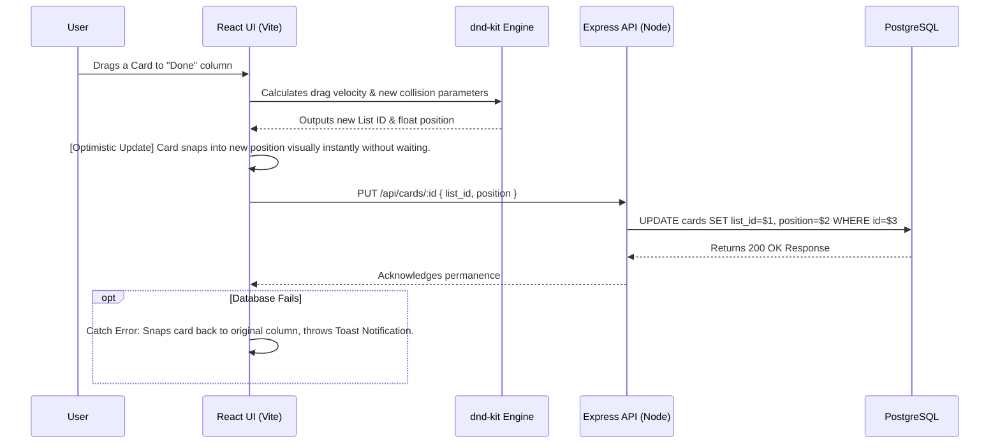

# Application System Workflows

This document outlines the two primary lifecycles of the application: The **Client-Server Actions Workflow** and the **CI/CD Deployment Workflow**.

---

## 1. Client-Server Interaction Workflow
How data flows when a user interacts with the Kanban Interface.

### Action Breakdown:
1. **Frontend Filtering:** The user types into the Search box. Instead of making an expensive `GET` request, the React state dynamically `filters()` the arrays in less than a millisecond, redrawing the DOM effortlessly.
2. **Deep Modal Queries:** When the user opens the entire board, the Backend aggregates `labels`, `members`, and deeply nested nested `checklists` into a single, massive JSON tree using `json_agg()` directly inside PostgreSQL. This saves the frontend from making 50 different API queries.

---

## 2. CI/CD Deployment Workflow
How the source code translates into a production environment.

1. **Local Development**: Developer generates code logic utilizing `npm run dev` on port `:5173`.
2. **Git Commit Phase**: Source code is stored locally and sent securely to a remote `GitHub` repository. 
   - *Security Note: `.gitignore` protects strict `.env` variables from entering public visibility.*
3. **Triggered Automation**:
   - **Backend (Render.com)**: A WebHook detects changing files in the `/backend` directory. It automatically spins up a Dockerized Linux container, runs `npm install`, and deploys using `node index.js`.
   - **Database (Render RDS)**: The backend successfully connects to the constantly running PostgreSQL instance via secure `DATABASE_URL` injections.
   - **Frontend (Vercel)**: A Vercel compiler detects updates in `/frontend`. Triggers `npm run build`, minimizing CSS/JS down to microscopic raw chunk assets, and distributes them globally to Cloudflare Edge Network CDNs for `<50ms` load times worldwide.
